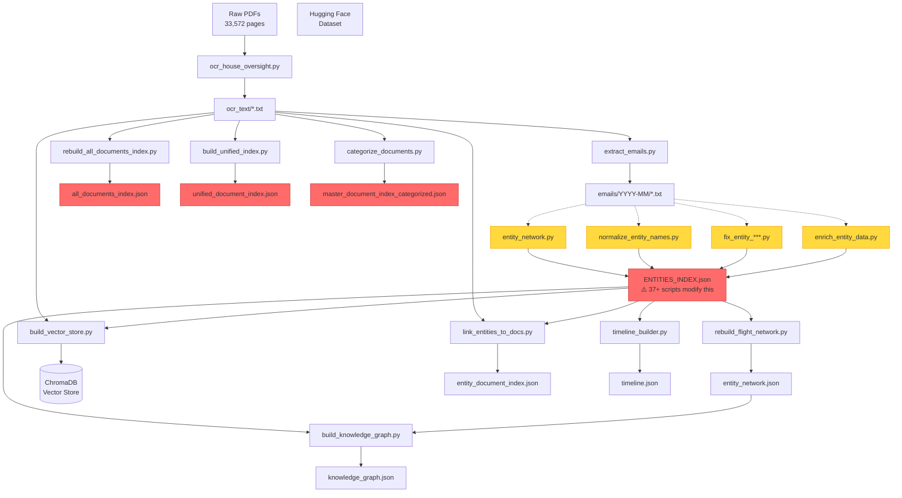

# Data Processing Pipeline Audit Report

**Quick Summary**: **Project**: Epstein Document Archive...

**Category**: Documentation
**Status**: Active
**Last Updated**: 2025-11-24

**Key Points**:
- ✅ **Strengths**: Comprehensive coverage, resumable operations, good logging
- ⚠️ **Critical Issues**: 37+ scripts modifying core entities, no clear single path, manual intervention required
- 🔴 **Risks**: Data inconsistency, duplicate work, difficult maintenance, no atomic operations

---

**Generated**: 2025-11-19
**Project**: Epstein Document Archive
**Total Scripts Analyzed**: 95 Python scripts across 15 directories

---

## Executive Summary

### Current State Health: 🟡 NEEDS CONSOLIDATION

The Epstein Document Archive has a **functional but fragmented** data processing architecture with:
- ✅ **Strengths**: Comprehensive coverage, resumable operations, good logging
- ⚠️ **Critical Issues**: 37+ scripts modifying core entities, no clear single path, manual intervention required
- 🔴 **Risks**: Data inconsistency, duplicate work, difficult maintenance, no atomic operations

**Key Finding**: The system evolved organically through iterative fixes rather than systematic design, resulting in **multiple competing paths** to the same outputs.

---

## 1. Current State Map

### Data Flow Overview

```
┌─────────────────────────────────────────────────────────────────────┐
│ STAGE 1: INGESTION                                                  │
├─────────────────────────────────────────────────────────────────────┤
│ Raw PDFs (33,572 pages)                                             │
│   ↓                                                                 │
│ download/*.sh scripts → data/sources/                               │
│   - house_oversight_nov2025/epstein-pdf/                           │
│   - giuffre_maxwell/                                                │
│   - documentcloud/                                                  │
│                                                                     │
│ Alternative: import/import_huggingface_*.py                         │
│   - Hugging Face datasets (20K documents)                           │
└─────────────────────────────────────────────────────────────────────┘

┌─────────────────────────────────────────────────────────────────────┐
│ STAGE 2: EXTRACTION                                                 │
├─────────────────────────────────────────────────────────────────────┤
│ extraction/ocr_house_oversight.py                                   │
│   Input:  data/sources/house_oversight_nov2025/epstein-pdf/*.pdf   │
│   Output: data/sources/house_oversight_nov2025/ocr_text/*.txt      │
│           data/sources/house_oversight_nov2025/ocr_progress.json    │
│   Features: Parallel OCR, email detection, resume capability        │
│                                                                     │
│ extraction/extract_emails.py                                        │
│   Input:  data/sources/house_oversight_nov2025/ocr_text/*.txt      │
│   Output: data/emails/house_oversight_nov2025/YYYY-MM/*.txt        │
│           data/emails/house_oversight_nov2025/EMAIL_INDEX.json      │
└─────────────────────────────────────────────────────────────────────┘

┌─────────────────────────────────────────────────────────────────────┐
│ STAGE 3: ENTITY PROCESSING (⚠️ FRAGMENTED - 37+ scripts)            │
├─────────────────────────────────────────────────────────────────────┤
│ PRIMARY OUTPUTS:                                                    │
│   • data/md/entities/ENTITIES_INDEX.json (1,639 entities)           │
│   • data/metadata/entity_network.json (387 entities, 2,221 edges)   │
│   • data/metadata/entity_biographies.json                           │
│                                                                     │
│ SCRIPTS THAT MODIFY ENTITIES_INDEX.json (37 found):                │
│   - analysis/entity_network.py ← Flight log co-occurrences          │
│   - analysis/fix_entity_names*.py (5 variants)                      │
│   - analysis/remove_invalid_entities.py                             │
│   - analysis/entity_disambiguator.py                                │
│   - analysis/batch_entity_disambiguation.py                         │
│   - analysis/comprehensive_entity_qa.py                             │
│   - data_quality/normalize_entity_names.py                          │
│   - data_quality/merge_epstein_duplicates.py                        │
│   - data_quality/restore_entity_bios.py                             │
│   - data_quality/fix_biography_names*.py (3 variants)               │
│   - research/enrich_entity_data.py                                  │
│   - research/basic_entity_whois.py                                  │
│   + 20+ more entity processing/fixing scripts                       │
│                                                                     │
│ ⚠️ ISSUE: No clear "canonical" entity builder - evolved via fixes   │
└─────────────────────────────────────────────────────────────────────┘

┌─────────────────────────────────────────────────────────────────────┐
│ STAGE 4: DOCUMENT INDEXING (⚠️ MULTIPLE INDEXES)                    │
├─────────────────────────────────────────────────────────────────────┤
│ data_quality/rebuild_all_documents_index.py                         │
│   Output: data/metadata/all_documents_index.json (18.9 MB)          │
│                                                                     │
│ indexing/build_unified_index.py                                     │
│   Output: data/metadata/unified_document_index.json (38 MB)         │
│                                                                     │
│ data_quality/categorize_documents.py                                │
│   Output: data/metadata/master_document_index_categorized.json      │
│                                                                     │
│ ⚠️ ISSUE: 3 different "master" document indexes exist               │
└─────────────────────────────────────────────────────────────────────┘

┌─────────────────────────────────────────────────────────────────────┐
│ STAGE 5: RAG & SEMANTIC INDEXING                                    │
├─────────────────────────────────────────────────────────────────────┤
│ rag/build_vector_store.py                                           │
│   Input:  data/sources/house_oversight_nov2025/ocr_text/*.txt      │
│   Output: data/vector_store/chroma/ (ChromaDB)                      │
│   Model:  sentence-transformers/all-MiniLM-L6-v2                    │
│   Features: Batch processing, resume capability, entity detection    │
│                                                                     │
│ rag/link_entities_to_docs.py                                        │
│   Input:  OCR text + ENTITIES_INDEX.json                            │
│   Output: data/metadata/entity_document_index.json                  │
│   Features: Entity mention counting, name variation matching         │
│                                                                     │
│ rag/kg_rag_integration.py                                           │
│   Input:  ChromaDB + entity_network.json + knowledge_graph.json     │
│   Output: Hybrid semantic + graph search                            │
└─────────────────────────────────────────────────────────────────────┘

┌─────────────────────────────────────────────────────────────────────┐
│ STAGE 6: DERIVED ARTIFACTS                                          │
├─────────────────────────────────────────────────────────────────────┤
│ analysis/timeline_builder.py                                        │
│   Output: data/metadata/timeline.json (66 KB)                       │
│   Source: Markdown files in data/md/                                │
│                                                                     │
│ analysis/build_knowledge_graph.py                                   │
│   Output: data/metadata/knowledge_graph.json (569 KB)               │
│                                                                     │
│ metadata/build_chatbot_knowledge_index.py                           │
│   Output: data/metadata/chatbot_knowledge_index.json                │
└─────────────────────────────────────────────────────────────────────┘
```

---

## 2. Identified Issues (Prioritized)

### 🔴 CRITICAL: Data Corruption Risks

#### **Issue 1: 37+ Scripts Modifying ENTITIES_INDEX.json**
- **Risk**: Race conditions, inconsistent state, manual merge conflicts
- **Evidence**:
  - `fix_entity_names.py`, `fix_entity_names_hybrid.py`, `fix_entity_name_formatting.py` (3 variants)
  - `normalize_entity_names.py`, `merge_epstein_duplicates.py`, `restore_entity_bios.py`
  - Multiple disambiguation scripts, QA scripts, enrichment scripts
- **Impact**: Cannot determine "correct" state of entity data
- **Example**:
  ```python
  # Multiple scripts all do: load → modify → save
  # No locking, no versioning, no conflict detection
  with open(ENTITIES_INDEX) as f:
      data = json.load(f)
  # ... modifications ...
  with open(ENTITIES_INDEX, 'w') as f:
      json.dump(data, f)
  ```

#### **Issue 2: No Atomic Writes**
- **Risk**: Partial updates on script failure leave corrupt JSON
- **Evidence**: All scripts use direct `json.dump()` without atomic write patterns
- **Impact**: Manual recovery required after failures

#### **Issue 3: Multiple "Master" Document Indexes**
- `all_documents_index.json` (18.9 MB)
- `unified_document_index.json` (38 MB)
- `master_document_index_categorized.json` (23 MB)
- **Risk**: Which is the source of truth? Indexes may be out of sync
- **Impact**: Queries may return different results depending on which index is used

### 🟡 HIGH: Manual Steps & No Orchestration

#### **Issue 4: No Dependency Tracking**
- Scripts must be run in correct order manually
- No way to know if upstream dependencies have changed
- Example: If `ENTITIES_INDEX.json` is updated, nothing triggers rebuild of:
  - `entity_network.json`
  - `semantic_index.json`
  - `entity_document_index.json`
  - ChromaDB embeddings metadata

#### **Issue 5: No Incremental Processing**
- Most scripts reprocess ALL data on each run
- Exception: OCR and vector store have resume capability
- Impact: 5-6 hour rebuilds for minor changes

#### **Issue 6: Manual Backup Management**
- Scripts create `.backup` files but no automated versioning
- Multiple backup directories: `backup_20251117_135528/`, `backup_20251117_135658/`, etc.
- No retention policy, no automatic cleanup

### 🟢 MEDIUM: Missing Documentation & Unclear Dependencies

#### **Issue 7: Unclear Script Purpose**
- Many scripts with similar names:
  - `fix_entity_names.py` vs `fix_entity_name_formatting.py` vs `fix_entity_names_hybrid.py`
  - `entity_disambiguator.py` vs `batch_entity_disambiguation.py` vs `mistral_entity_disambiguator.py`
- No clear indication which is "current" vs "deprecated"

#### **Issue 8: Hard-Coded Paths**
- All scripts have hard-coded `/Users/masa/Projects/Epstein` paths
- Not portable across environments
- Difficult to run in CI/CD

#### **Issue 9: No Logging Standards**
- Some scripts use Python `logging`
- Some use custom loggers
- Some just use `print()`
- No centralized log aggregation

### 🔵 LOW: Optimization Opportunities

#### **Issue 10: Redundant Processing**
- Entity enrichment happens in multiple places:
  - `research/enrich_entity_data.py`
  - `research/basic_entity_whois.py`
  - `analysis/enrich_entity_relationships.py`
- Similar entity mention detection in:
  - `rag/link_entities_to_docs.py`
  - `rag/build_vector_store.py`

---

## 3. Dependency Graph (DAG)

### Dependency Analysis



### Circular Dependencies: ❌ None Found
Good news: The pipeline is **acyclic** (no circular dependencies).

### Manual Intervention Points: 🔧 Multiple

1. **Choosing which entity fix script to run** (37+ options)
2. **Merging entity changes** when multiple scripts run concurrently
3. **Selecting which document index to use** (3 options)
4. **Determining rebuild order** (no orchestration)
5. **Managing backups** (manual directory creation)

---

## 4. Gap Analysis

### What's Missing

#### **Pipeline Orchestration**
- ❌ No Makefile, DAG runner, or orchestration tool
- ❌ No dependency tracking (`make`-style "build if changed")
- ❌ No way to run "full rebuild" with one command

#### **State Tracking**
- ❌ No "last processed timestamp" metadata
- ❌ No way to detect "entity index changed, need to rebuild network"
- ❌ No provenance tracking (which script created this data?)

#### **Version Control for Data**
- ❌ No semantic versioning of data artifacts
- ❌ No changelog for data transformations
- ❌ Backups use timestamps but no structured versioning

#### **Validation & Testing**
- ❌ No schema validation (though Pydantic models exist in some scripts)
- ❌ No automated tests for pipeline integrity
- ❌ No data quality checks after each stage

#### **Monitoring & Alerting**
- ❌ No metrics on pipeline health
- ❌ No alerting on failures
- ❌ Logs scattered across scripts

#### **Incremental Updates**
- ❌ Most scripts reprocess everything
- ❌ No "delta processing" for new documents
- ❌ No efficient "update entity X" operation

---

## 5. Recommended Pipeline Architecture

### Core Principles

1. **Single Source of Truth**: One canonical script per transformation
2. **Idempotent Operations**: Safe to re-run without corruption
3. **Atomic Writes**: All-or-nothing file updates
4. **Dependency Tracking**: Automatic invalidation and rebuild
5. **Incremental Processing**: Process only what changed
6. **Full Provenance**: Track what created each artifact and when

### Proposed Architecture

```
epstein_pipeline/
├── stages/
│   ├── 01_ingest.py           # Download & import raw data
│   ├── 02_extract.py           # OCR & email extraction
│   ├── 03_entities.py          # Entity extraction & resolution
│   ├── 04_enrich.py            # Entity enrichment (bio, research)
│   ├── 05_index_docs.py        # Document indexing
│   ├── 06_build_network.py     # Entity network construction
│   ├── 07_build_rag.py         # Vector store + semantic index
│   ├── 08_build_derived.py     # Timeline, knowledge graph
│   └── 09_validate.py          # Data quality checks
│
├── lib/
│   ├── atomic_io.py            # Atomic file writes
│   ├── provenance.py           # Track data lineage
│   ├── state_manager.py        # Track what's been processed
│   ├── entity_manager.py       # Centralized entity CRUD
│   └── config.py               # Centralized configuration
│
├── orchestration/
│   ├── pipeline.py             # Main orchestrator
│   ├── dag.py                  # Dependency graph definition
│   └── scheduler.py            # Incremental execution
│
├── config/
│   ├── pipeline.yaml           # Pipeline configuration
│   ├── paths.yaml              # Path configuration
│   └── logging.yaml            # Logging configuration
│
└── cli/
    ├── run.py                  # Run full pipeline
    ├── rebuild.py              # Force rebuild specific stage
    ├── status.py               # Show pipeline status
    └── validate.py             # Validate pipeline state
```

### Stage Design Pattern

Each stage follows this pattern:

```python
#!/usr/bin/env python3
"""
Stage 03: Entity Processing
Canonical entity extraction and resolution
"""

from epstein_pipeline.lib import atomic_write, StateManager, ProvenanceTracker
from epstein_pipeline.lib.entity_manager import EntityManager

class EntityProcessingStage:
    def __init__(self, config):
        self.config = config
        self.state = StateManager(config.state_file)
        self.provenance = ProvenanceTracker()
        self.entity_mgr = EntityManager(config.entities_path)

    def needs_run(self) -> bool:
        """Check if upstream dependencies changed"""
        upstream_modified = self.state.get_upstream_timestamp('02_extract')
        last_run = self.state.get_stage_timestamp('03_entities')
        return upstream_modified > last_run

    def run(self):
        """Execute stage (idempotent)"""
        if not self.needs_run():
            logger.info("Skipping: No upstream changes")
            return

        logger.info("Starting entity processing...")

        # Load inputs
        emails = self.load_emails()

        # Process
        entities = self.extract_entities(emails)
        entities = self.resolve_duplicates(entities)

        # Atomic write
        with atomic_write(self.config.entities_path) as f:
            json.dump({
                'entities': entities,
                'metadata': {
                    'generated_by': 'stage_03_entities',
                    'version': '1.0',
                    'timestamp': datetime.now().isoformat(),
                    'upstream': self.state.get_upstream_hashes()
                }
            }, f, indent=2)

        # Update state
        self.state.mark_complete('03_entities')
        self.provenance.log_transformation(
            stage='03_entities',
            inputs=['emails'],
            outputs=['ENTITIES_INDEX.json']
        )
```

### Atomic Write Pattern

```python
@contextmanager
def atomic_write(filepath: Path):
    """Atomic file write - all or nothing"""
    tmp_file = filepath.with_suffix('.tmp')
    try:
        with open(tmp_file, 'w') as f:
            yield f
        # Only replace original if write succeeded
        tmp_file.replace(filepath)
    except Exception:
        if tmp_file.exists():
            tmp_file.unlink()
        raise
```

### State Tracking

```yaml
# .pipeline_state.yaml
stages:
  01_ingest:
    last_run: 2025-11-19T10:30:00
    status: success
    outputs:
      - path: data/sources/house_oversight_nov2025/
        hash: a3f5d9e1...

  02_extract:
    last_run: 2025-11-19T11:00:00
    status: success
    inputs:
      - data/sources/house_oversight_nov2025/
    outputs:
      - path: data/sources/house_oversight_nov2025/ocr_text/
        hash: b7c3e4f2...

  03_entities:
    last_run: 2025-11-19T12:00:00
    status: success
    inputs:
      - data/sources/house_oversight_nov2025/ocr_text/
    outputs:
      - path: data/md/entities/ENTITIES_INDEX.json
        hash: d8a2f1c9...
```

### Centralized Entity Manager

```python
class EntityManager:
    """Single source of truth for entity operations"""

    def __init__(self, entities_path: Path):
        self.path = entities_path
        self._lock = FileLock(entities_path.with_suffix('.lock'))

    def get_entity(self, name: str) -> Optional[Entity]:
        """Get entity by name"""
        with self._lock:
            data = self._load()
            return data.get('entities', {}).get(name)

    def update_entity(self, name: str, updates: Dict):
        """Update entity (atomic)"""
        with self._lock:
            data = self._load()
            entity = data['entities'].get(name, {})
            entity.update(updates)
            data['entities'][name] = entity
            self._save(data)

    def merge_duplicates(self, keep: str, merge: List[str]):
        """Merge duplicate entities"""
        with self._lock:
            # ... atomic merge logic ...
            pass
```

### Orchestration

```python
# orchestration/pipeline.py

class Pipeline:
    def __init__(self, config_path: Path):
        self.config = Config.load(config_path)
        self.stages = self._load_stages()
        self.dag = self._build_dag()

    def run(self, force_rebuild: bool = False):
        """Run pipeline end-to-end"""
        for stage in self.dag.topological_sort():
            if force_rebuild or stage.needs_run():
                logger.info(f"Running stage: {stage.name}")
                stage.run()
            else:
                logger.info(f"Skipping stage: {stage.name} (up to date)")

    def rebuild_stage(self, stage_name: str):
        """Rebuild specific stage and downstream"""
        stage = self.stages[stage_name]
        downstream = self.dag.get_downstream(stage)

        stage.run()
        for downstream_stage in downstream:
            downstream_stage.run()
```

---

## 6. Migration Path

### Phase 1: Stabilization (Week 1-2) - LOW RISK

**Goal**: Stop the bleeding, prevent further fragmentation

#### Tasks:
1. **Freeze entity modifications**
   - Create `entity_manager.py` with locking
   - Deprecate all 37 entity scripts (add warnings)
   - Document which scripts are "canonical" vs "one-off fixes"

2. **Add atomic writes**
   - Create `lib/atomic_io.py`
   - Update critical scripts:
     - `entity_network.py`
     - `rebuild_all_documents_index.py`
     - `build_vector_store.py`

3. **Consolidate document indexes**
   - Determine which index is source of truth (recommend `all_documents_index.json`)
   - Mark others as deprecated or derived
   - Document index purposes

4. **Add basic state tracking**
   - Create `.pipeline_state.yaml`
   - Track last-modified timestamps for key artifacts

**Deliverable**: No more data corruption, clear documentation of current state

---

### Phase 2: Consolidation (Week 3-4) - MEDIUM RISK

**Goal**: Reduce 95 scripts to ~10 canonical stages

#### Tasks:
1. **Create `stages/` directory**
   - Implement `01_ingest.py` (consolidate download scripts)
   - Implement `02_extract.py` (OCR + email extraction)
   - Implement `03_entities.py` (CANONICAL entity processing)
   - Implement `04_enrich.py` (entity enrichment)
   - Implement `05_index_docs.py` (single document index)

2. **Build `lib/` utilities**
   - `entity_manager.py` - Centralized entity CRUD
   - `atomic_io.py` - Atomic file operations
   - `state_manager.py` - Track processing state
   - `provenance.py` - Data lineage tracking

3. **Create orchestration**
   - `orchestration/dag.py` - Define dependencies
   - `orchestration/pipeline.py` - Run stages in order
   - `cli/run.py` - Command-line interface

4. **Migrate existing data**
   - Run new pipeline on clean slate (test dataset)
   - Validate outputs match current system
   - Document differences

**Deliverable**: Working unified pipeline (parallel to old system)

---

### Phase 3: Migration (Week 5-6) - HIGHER RISK

**Goal**: Switch production to new pipeline

#### Tasks:
1. **Full validation**
   - Compare outputs: old system vs new pipeline
   - Document any discrepancies
   - Fix bugs in new pipeline

2. **Cutover**
   - Backup current data artifacts
   - Run new pipeline on production data
   - Validate outputs
   - Update frontend/API to use new paths

3. **Deprecation**
   - Move old scripts to `scripts/legacy/`
   - Add deprecation warnings
   - Update all documentation

4. **Monitoring**
   - Add pipeline health metrics
   - Set up alerting for failures
   - Create dashboard for status

**Deliverable**: Production running on unified pipeline

---

### Phase 4: Optimization (Week 7-8) - LOW RISK

**Goal**: Make pipeline faster and more maintainable

#### Tasks:
1. **Add incremental processing**
   - Track processed documents (checksums)
   - Only process new/changed files
   - Add "delta" mode to stages

2. **Parallelize where possible**
   - Parallel OCR (already exists)
   - Parallel embedding generation
   - Parallel entity enrichment

3. **Add caching**
   - Cache entity lookups
   - Cache embedding computations
   - Cache common queries

4. **Improve observability**
   - Centralized logging
   - Metrics collection
   - Performance profiling

**Deliverable**: Fast, efficient, maintainable pipeline

---

## 7. Recommended Technology Stack

### Orchestration Options

#### Option 1: **Makefile** (Simplest)
✅ Pros:
- Already available on all systems
- Built-in dependency tracking
- Simple mental model

❌ Cons:
- File-based only (no database dependencies)
- Limited parallelization
- No dynamic scheduling

```makefile
# Makefile
data/md/entities/ENTITIES_INDEX.json: data/sources/house_oversight_nov2025/ocr_text/*.txt
	python3 stages/03_entities.py

data/metadata/entity_network.json: data/md/entities/ENTITIES_INDEX.json
	python3 stages/06_build_network.py
```

#### Option 2: **Python Script** (Recommended)
✅ Pros:
- Full control
- Easy to extend
- No external dependencies
- Can track state in YAML/JSON

❌ Cons:
- Need to implement dependency logic yourself

```python
# Simple Python orchestrator
class Pipeline:
    def run(self):
        if self.stage_needs_run('03_entities'):
            self.run_stage('03_entities')
        if self.stage_needs_run('06_network'):
            self.run_stage('06_network')
```

#### Option 3: **Prefect/Airflow** (Overkill)
✅ Pros:
- Professional-grade orchestration
- Built-in monitoring, retries, scheduling
- Web UI

❌ Cons:
- Heavy infrastructure
- Steep learning curve
- Overkill for this project size

**Recommendation**: Start with **Python script** (Option 2), consider Makefile for simple dependencies.

---

## 8. Quick Start: Immediate Actions

### This Week (High Impact, Low Effort)

1. **Create `scripts/DEPRECATED/` directory**
   ```bash
   mkdir -p scripts/DEPRECATED
   # Move one-off fix scripts here
   mv scripts/analysis/fix_entity_names*.py scripts/DEPRECATED/
   ```

2. **Document current "canonical" scripts**
   ```markdown
   # scripts/CANONICAL_SCRIPTS.md

   These are the ONLY scripts that should modify core data:

   - Entity Data: `analysis/entity_network.py`
   - Document Index: `data_quality/rebuild_all_documents_index.py`
   - Vector Store: `rag/build_vector_store.py`

   All other scripts are DEPRECATED or one-off fixes.
   ```

3. **Add atomic write helper**
   ```python
   # scripts/lib/atomic_io.py
   from contextlib import contextmanager

   @contextmanager
   def atomic_write(filepath):
       tmp = filepath.with_suffix('.tmp')
       try:
           with open(tmp, 'w') as f:
               yield f
           tmp.replace(filepath)
       except:
           tmp.unlink()
           raise
   ```

4. **Add last-modified tracking**
   ```python
   # Add to all critical scripts:
   metadata = {
       'generated': datetime.now().isoformat(),
       'generator': 'entity_network.py',
       'version': '1.0'
   }
   ```

---

## Appendix A: Script Inventory

### By Category

**Extraction (2 scripts)**
- `extraction/ocr_house_oversight.py` - OCR processing ✅
- `extraction/extract_emails.py` - Email extraction ✅

**Import (4 scripts)**
- `import/import_huggingface_documents.py`
- `import/import_huggingface_emails.py`
- `import/README.md`
- `import/test_import.py`

**Entity Processing (37 scripts)** ⚠️
- Core: `analysis/entity_network.py`
- Fixes: `analysis/fix_entity_names*.py` (5 variants)
- Disambiguation: `analysis/*disambiguation*.py` (4 scripts)
- QA: `analysis/*_qa*.py` (3 scripts)
- Normalization: `data_quality/normalize_entity_names.py`
- Enrichment: `research/enrich_entity_data.py`
- +20 more

**Document Indexing (8 scripts)** ⚠️
- `data_quality/rebuild_all_documents_index.py`
- `indexing/build_unified_index.py`
- `data_quality/categorize_documents.py`
- `analysis/rebuild_document_stats.py`
- +4 more

**RAG (8 scripts)**
- `rag/build_vector_store.py` ✅
- `rag/link_entities_to_docs.py` ✅
- `rag/kg_rag_integration.py`
- `rag/query_rag.py`

**Derived Artifacts (3 scripts)**
- `analysis/timeline_builder.py`
- `analysis/build_knowledge_graph.py`
- `metadata/build_chatbot_knowledge_index.py`

**Data Quality (17 scripts)**
- Categorization, validation, normalization

**Download (10 scripts)**
- Various source downloaders

---

## Appendix B: Key Data Artifacts

| Artifact | Size | Scripts That Modify | Last Updated |
|----------|------|---------------------|--------------|
| `ENTITIES_INDEX.json` | 564 KB | **37+ scripts** | 2025-11-19 |
| `entity_network.json` | 298 KB | 22 scripts | 2025-11-17 |
| `all_documents_index.json` | 18.9 MB | 5 scripts | 2025-11-18 |
| `unified_document_index.json` | 38 MB | 2 scripts | 2025-11-17 |
| `semantic_index.json` | 450 KB | 3 scripts | 2025-11-17 |
| `timeline.json` | 70 KB | 1 script | 2025-11-17 |
| `knowledge_graph.json` | 569 KB | 1 script | 2025-11-17 |
| ChromaDB | ~2 GB | 1 script | 2025-11-17 |

---

## Conclusion

The Epstein Document Archive has **solid foundational scripts** but lacks **orchestration and consolidation**. The path forward is clear:

1. **Immediate**: Freeze modifications, add atomic writes, document canonical scripts
2. **Short-term**: Build unified pipeline with 10 core stages
3. **Medium-term**: Migrate production to new pipeline
4. **Long-term**: Optimize for incremental processing and monitoring

**Estimated Effort**: 6-8 weeks for full migration
**Risk Level**: Medium (existing scripts work, new pipeline runs parallel)
**ROI**: High (maintainability, correctness, speed)

---

**Next Steps**: Review this report and decide whether to proceed with Phase 1 (Stabilization).
