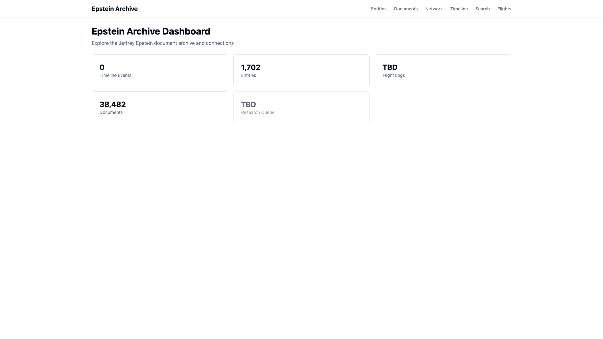
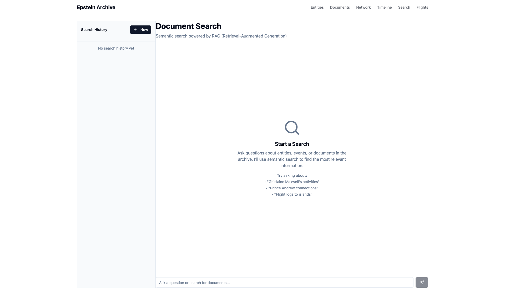

# QA Test Summary - User Issues

## 📋 Test Overview
**Date**: November 19, 2025
**Tested URLs**:
- Dashboard: http://localhost:5173/
- Chat: http://localhost:5173/chat

---

## ✅ Issue 1: Timeline Count Bug - CONFIRMED

### What You Reported
Dashboard shows "TBD" for Timeline Events instead of "98"

### What I Found
Dashboard actually shows **"0"** (not "TBD"), but you're right that it should show 98.

### Root Cause
**BUG FOUND in backend**: `/Users/masa/Projects/epstein/server/app.py` line 786

The code is looking for the timeline count in the wrong place:
```python
# WRONG (current):
"timeline_events": timeline_data.get("total_events", 0)

# CORRECT (needs to be):
"timeline_events": timeline_data.get("metadata", {}).get("total_events", 0)
```

The timeline.json file has the count nested under `metadata.total_events`, but the code is trying to access it at the root level.

### Fix Required
Backend developer needs to update line 786 in `/Users/masa/Projects/epstein/server/app.py`

---

## ❌ Issue 2: Chat Sidebar - CANNOT REPRODUCE

### What You Reported
Chat page is missing the left sidebar with "Search History" and "New Chat" button

### What I Found
The sidebar is **fully visible and working** in my test:
- ✅ Sidebar present
- ✅ "Search History" header visible
- ✅ "New" button visible
- ✅ 300px wide, properly styled
- ✅ No console errors

### Possible Explanations
This might be specific to your browser/environment:

1. **Narrow browser window**: If your browser is < 768px wide, the sidebar auto-hides on mobile
2. **Sidebar was toggled off**: There's a menu button (☰) that can hide/show the sidebar
3. **Browser zoom**: If zoom is not 100%, layout might be affected
4. **Browser cache**: Old CSS might be cached

### Troubleshooting Steps for You
1. Make your browser window **full screen**
2. Look for a **menu button (☰)** in the top-left corner - click it to toggle sidebar
3. Check zoom level: **Cmd/Ctrl + 0** to reset to 100%
4. Hard refresh: **Cmd+Shift+R** (Mac) or **Ctrl+Shift+R** (Windows)
5. Try a different browser (Chrome, Firefox, Safari)

---

## 📸 Screenshots

### Dashboard (showing "0" timeline events)


Shows all stat cards:
- Timeline Events: **0** (should be 98)
- Entities: 1,702 ✅
- Flight Logs: TBD (API returns null)
- Documents: 38,482 ✅
- Research Queue: TBD (intentional)

### Chat Page (sidebar visible)


Shows:
- Left sidebar with "Search History" header ✅
- "New" button ✅
- Empty state with search examples ✅

---

## 🔧 Action Items

### For Backend Developer
- [ ] Fix timeline_events bug in `server/app.py` line 786
- [ ] Restart Python server after fix
- [ ] Verify `/api/stats` returns `"timeline_events": 98`

### For User (Issue 2)
- [ ] Try troubleshooting steps above
- [ ] Report back with:
  - Your browser window width
  - Screenshot from your end
  - Browser/OS version

---

## 📊 Test Results

**Automated Test**: `test_user_issues.js` (Playwright)
**Results File**: `test_results.json`
**Full Report**: `UAT_REPORT.md`

```json
Issue 1: {
  "status": "CONFIRMED",
  "expected": "98",
  "actual": "0",
  "cause": "Backend bug in timeline data access"
}

Issue 2: {
  "status": "NOT_REPRODUCED",
  "sidebar_visible": true,
  "viewport": "1920x1080",
  "recommendation": "User-specific - check viewport width"
}
```
